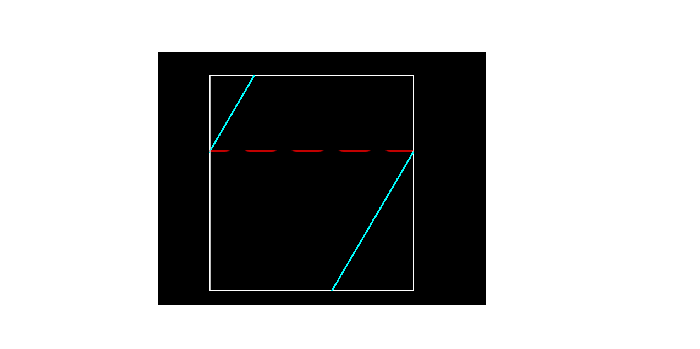
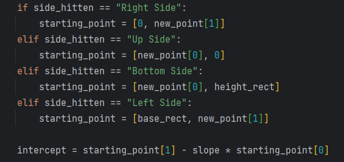
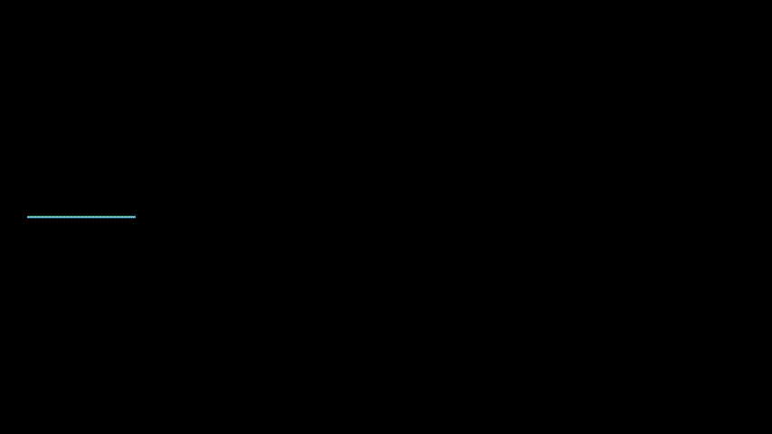
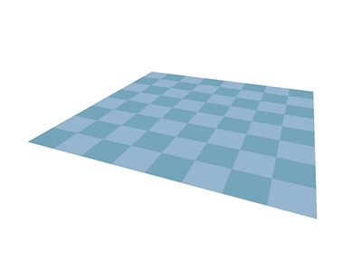
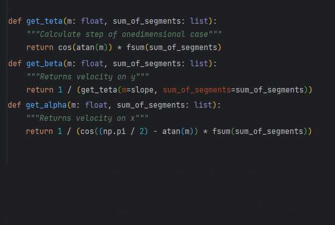
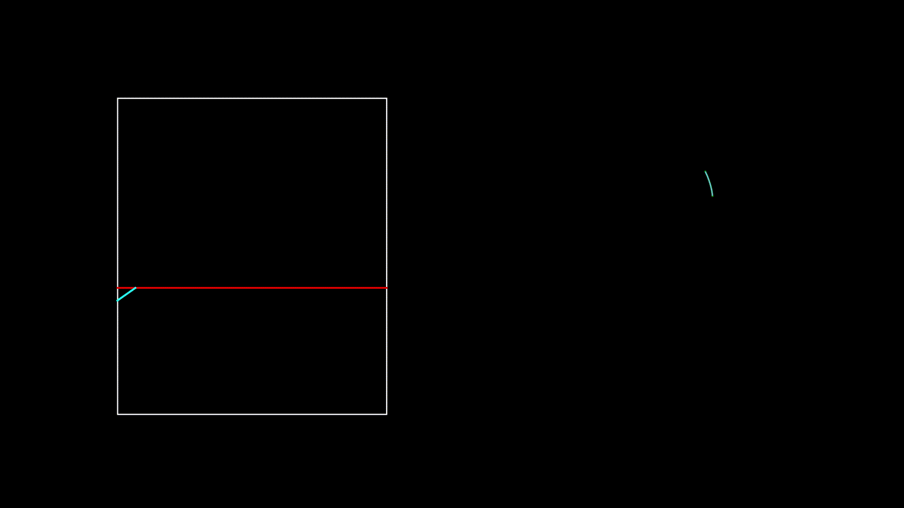

*Unfolding the Billiard*

**Introduzione**

È stata sviluppata una simulazione volta a mostrare i risultati ottenuti
nel paper *"Trajectory tracking in rectangular billiards by unfolding
the billiard table"* dell'Università di Roma Tor Vergata. In
particolare, il moto di una pallina all'interno di un biliardo, con
pareti elastiche, può essere mappato sulla superficie di un toroide.

**Tavolo del Biliardo**

Innanzitutto, mediante l'uso di Matplot Lib, una libreria di Python,
vengono tracciate delle linee di riferimento che individuano il
perimetro di un quadrilatero. Tale oggetto rappresenta il "campo da
gioco" della simulazione ossia il *biliardo*. Successivamente, si
definiscono le coordinate di un punto detto *spawn point*, il quale
giace all'interno del *biliardo* definito precedentemente, che
costituisce il punto di partenza della simulazione, di fatto una
pallina.

Il moto della pallina è costruito analiticamente: si fissa una direzione
arbitraria e si traccia una retta che ne indica la traiettoria. È chiaro
che, durante il moto, la pallina urterà le pareti del *biliardo*. Per
cui, piuttosto che far rimbalzare la pallina, è stato implementato
l'effetto pac-man sulle pareti, in questo modo la pallina sbucherà fuori
dalla parte opposta.

{width="1.8958333333333333in"
height="1.9479166666666667in"}

**Costruzione delle traiettorie**

A partire dalla prima traiettoria vengono tracciate le successive sulla
base della seguente logica;

{width="3.5131944444444443in"
height="1.6541666666666666in"}

È importante notare che l'angolo d'incidenza traiettoria-parete,
rispetto alla normale della parete stessa, non può essere pari a
$\Rightarrow \frac{\pi}{2}$ per due motivi. Il primo è che la pallina
continuerebbe a rimbalzare da bordo a bordo (orizzontalmente o
verticalmente) e le traiettorie sarebbero tutte sovrapposte, quindi un
caso banale privo di interesse. Il secondo motivo, decisamente più
matematico, è che la pendenza di una retta è pari alla tangente
dell'angolo che essa forma con l'asse delle ascisse:

$$\Rightarrow m = {tg}(\alpha)$$

Ricordando il dominio della funzione tangente risulta chiaro che
l'angolo di incidenza non può essere mai pari a
$\Rightarrow \frac{\pi}{2}$ .

Inoltre, si precisa che: nel caso in cui la pallina urti perfettamente
uno degli spigoli del *biliardo*, le traiettorie sarebbero tutte
sovrapposte e quindi un ulteriore caso privo d'interesse.

**Traiettorie Dense**

Innanzitutto si osservi l'animazione riportata di seguito:

{width="6.2625in" height="3.5208333333333335in"}

Si nota che a partire da un segmento, unendo le due estremità, si giunge
ad una circonferenza. Si passa poi ad un Toroide facendo ruotare la
circonferenza attorno ad un asse e preservandone la traccia durante il
suo moto (colorata in arcobaleno).

Tale animazione è intesa come strumento esemplificativo per comprendere
che le considerazioni relative al caso unidimensionale possono essere
estese al caso tridimensionale.

Si consideri dunque la funzione:

$$\ \ \ \ \  \Rightarrow \ \ T_{\theta}:\lbrack 0,1) \rightarrow \lbrack 0,1)$
con $\theta\mathbb{\in R}$$*.*

$$x \mapsto { x + \theta }$$

Per semplicità si considera un segmento di lunghezza unitaria e si fissa
un punto di partenza $x \in \lbrack 0,1)$. Vale che:

$$\Rightarrow T_{\theta}^{0}(x) = x$$

$$\Rightarrow T_{\theta}^{1}(x) = T_{\theta}^{0}(x)$$

$$\Rightarrow T_{\theta}^{2}(x) = T_{\theta}^{1}\left( T_{\theta}^{0}(x) \right)$$

$$\Rightarrow T_{\theta}^{n} = \left( T_{\theta} \circ T_{\theta} \circ \cdots \circ T_{\theta} \right)(x)$$

***Lemma 1***

Sia $\Rightarrow T_{\theta}^{n}(x) = \left\{ x + n\theta \right\}$ per
ogni $n\mathbb{\in N}$. Si dimostra per induzione.

Per $n = 0$, si ha per definizione che:

$$\Rightarrow T_{\theta}^{0}(x) = x$$

Al passo n si ha:

$$\Rightarrow T_{\theta}^{n}(x) = \left\{ x + n\theta \right\}$$

Si applica $T_{\theta}$ ambo i membri:

$$\Rightarrow T_{\theta} \circ T_{\theta}^{n}(x) = T_{\theta}\left( \left\{ x + n\theta \right\} \right)$$

$$\Rightarrow T_{\theta}^{n + 1}(x) = \left\{ \left\{ x + n\theta \right\} + \theta \right\}$$

$$= \left\{ (x + n\theta) - \lbrack x + n\theta\rbrack + \theta \right\}$$

$$= \left\{ x + (n + 1)\theta - \lbrack x + n\theta\rbrack \right\}$$

$$= x + (n + 1)\theta - \lbrack x + n\theta\rbrack - \left\lbrack x + (n + 1)\theta - \lbrack x + n\theta\rbrack \right\rbrack$$

$$= x + (n + 1)\theta - \lbrack x + n\theta\rbrack - \left\lbrack x + (n + 1)\theta \right\rbrack + \lbrack x + n\theta\rbrack$$

$= \left\{ x + (n + 1)\theta \right\}$

> ◻

Si definisce inoltre l'immagine della successione
$\left\{ T_{\theta}^{n}(x) \right\}_{n}$ ,

l'insieme
$\Rightarrow \tau(x) = \left\{ T_{\theta}^{n}(x):n\mathbb{\in N} \right\}$.
Vale che $\Rightarrow \tau(x) \subseteq \lbrack 0,1)$.

***Teorema 1***

La successione $\left\{ T_{\theta}^{n}(x) \right\}_{n}$ è periodica
$\Leftrightarrow \theta\mathbb{\in Q}$.

DIM:

Se la successione è periodica, allora esiste un $N\mathbb{\in N}$ tale
che:

$$\Rightarrow T_{\theta}^{0}(x) = x = T_{\theta}^{N}(x) = x + N\theta - \lbrack x + N\theta\rbrack$$

Da cui:

$$\Rightarrow \theta = \frac{\lbrack x + N\theta\rbrack}{N}$$

Essendo $\theta$ dato dal rapporto di due numeri interi, allora è un
numero razionale e si può scrivere più in generale:

$\Rightarrow \theta = \frac{N}{M}\mathbb{\in Q}$ con
$N,M\mathbb{\in Z \smallsetminus}\left\{ 0 \right\}$

Per $\theta = 0$, si ha il caso base della definizione ed il teorema è
chiaramente verificato. Mentre per dimostrare il teorema globalmente
basta considerare anche un solo caso in cui si nota la periodicità. Per
esempio, al passo $M$ si avrà:

$$\Rightarrow T_{\theta}^{M}(x) = \left\{ x + M\theta \right\} = \left\{ x + M\frac{N}{M} \right\} = \left\{ x + N \right\} = \left\{ x \right\} = x = T_{\theta}^{0}(x)$$

> ◻

***Lemma 2***

Si definisce in $\tau(x)$ la distanza tra due punti
$x,y \in \lbrack 0,1)$, la quantità:

$$\Rightarrow \mathbb{d}(x,y) = min\left\{ |x - y|,|x - y + 1|,|x - y - 1| \right\}$$

E si scrive:

$\Rightarrow \mathbb{d}(x,y) = \mathbb{d}\left( T_{\theta}^{n}(x),T_{\theta}^{n}(y) \right)$
per ogni $n\mathbb{\in N}$

{width="5.249305555555556in"
height="2.9506944444444443in"}

Quando a partire dal segmento si giunge alla circonferenza, si hanno due
modi per collegare due punti: si formano due archi. La distanza è data
quindi dall'arco di lunghezza minima. La facoltà di scegliere il
percorso minore è contemplata quando si considera l'offset di $\pm 1$ a
seconda dei casi.

***Teorema 2***

La successione $\left\{ T_{\theta}^{n}(x) \right\}_{n}$ non è periodica
$\Leftrightarrow \theta\mathbb{\in R \smallsetminus Q}$. In altre parole
l'immagine $\tau(x)$ è densa in $\lbrack 0,1)$.

DIM:

i.  Si verifica innanzitutto che elementi di $T_{\theta}^{n}(x)$ siano
    tutti diversi.

Se così non fosse sarebbe:

$\Rightarrow T_{\theta}^{n}(x) = T_{\theta}^{m}(x)$ per qualche
$n,m\mathbb{\in N}$

$$\Rightarrow \left\{ x + n\theta \right\} = \left\{ x + m\theta \right\}$$

$$\Rightarrow x + n\theta - \lbrack x + n\theta\rbrack = x + m\theta - \lbrack x + m\theta\rbrack$$

$$\Rightarrow \theta = \frac{\lbrack x + n\theta\rbrack - \lbrack x + m\theta\rbrack}{n - m}$$

In questo caso $\theta$ è dato dal rapporto di due numeri interi per cui
$\Rightarrow \theta\mathbb{\in Q}$. Ma si era detto che
$\theta \in \mathbb{R \smallsetminus Q}$. Quindi gli elementi della
successione sono tutti diversi
$\Leftrightarrow \theta\mathbb{\in R \smallsetminus Q}$, altrimenti si
ricadrebbe nel caso del *Teorema 1*, ossia la successione è periodica.

ii. Si verifica adesso che l'immagine $\tau(x)$ sia densa in
    $\lbrack 0,1)$.

Si divida il segmento unitario, in cui è definita la successione, in $N$
intervallini di lunghezza $\frac{1}{N}$. Se si considera il fatto che la
successione parte dal passo $T_{\theta}^{0}(x)$ ed arriva al paso
$T_{\theta}^{n}(x)$, allora saranno generati $N + 1$ numeri. Affinché
questi stiano all'interno della precedente suddivisione, deve essere che
almeno un intervallino ne contenga almeno due. Siano questi:

$\Rightarrow T_{\theta}^{n_{0}}(x)\ e\ T_{\theta}^{m_{0}}(x)$ con
$n_{0},m_{0} \in \left\{ 0,1,2,\ldots,N \right\}$

Vale quindi che:

$$\Rightarrow \left| T_{\theta}^{n_{0}}(x)\  - \ T_{\theta}^{m_{0}}(x) \right| < \frac{1}{N}$$

Tenendo conto del *Lemma 2* si ottiene che:

$$\Rightarrow \mathbb{d}\left( \ T_{\theta}^{m_{0}}(x),\ T_{\theta}^{n_{0}}(x) \right) < \frac{1}{N}$$

Si applica $T_{\theta}^{- m_{0}}$ (con $n_{0} > m_{0}$):

$$\Rightarrow \mathbb{d}\left( \ T_{\theta}^{{- m}_{0}}(x) \circ T_{\theta}^{m_{0}}(x),\ ,\ T_{\theta}^{{- m}_{0}} \circ T_{\theta}^{n_{0}}(x) \right) < \frac{1}{N}$$

$$\Rightarrow \mathbb{d}\left( x,T_{\theta}^{n_{0} - m_{0}}(x) \right) < \frac{1}{N}$$

Si consideri ora la successione:

$$\Rightarrow \left\{ x_{j} \right\}_{j} = \left\{ T_{\theta}^{j\left( n_{0} - m_{0} \right)}(x) \right\}$$

Si nota che questa è una sotto-successione di
$\left\{ T_{\theta^{(x)}}^{n} \right\}_{n}$.

Si applichi ora il *Lemma 2* tra due punti della sotto-successione:

$$\Rightarrow \mathbb{d}\left( T_{\theta}^{j\left( n_{0} - m_{0} \right)}(x),T_{\theta}^{(j + 1)\left( n_{0} - m_{0} \right)}(x) \right)$$

$$= \mathbb{d}\left( T_{\theta}^{j\left( n_{0} - m_{0} \right)}(x),T_{\theta}^{j\left( n_{0} - m_{0} \right)}\left( T_{\theta}^{n_{0} - m_{0}}(x) \right) \right)$$

Si applica $T_{\theta}^{- j\left( n_{0} - m_{0} \right)}$:

$$= \mathbb{d}\left( x,T_{\theta}^{n_{0} - m_{0}}(x) \right) < \frac{1}{N}$$

> Quindi si è ottenuta una sotto-successione che ha un passo più breve
> di quella di partenza. Poiché è possibile scegliere $N$ grande quanto
> si vuole, allora anche il passo può essere piccolo quanto si vuole.

$\Rightarrow \tau(x)$ è densa in $\lbrack 0,1)$.

**Mappatura sul Toroide**

Un Toroide può essere definito mediante le seguenti equazioni
parametriche:

$$\left\{ \begin{array}{r}
x(\omega,\varphi) = \left( R + r \cdot \cos\omega \right)\cos\varphi \\
y(\omega,\varphi) = \left( R + r \cdot \cos\omega \right)\sin\varphi \\
z(\omega,\varphi) = r \cdot \sin\omega \\
\end{array}{\ \ \ \ \ \ \ \ \ \ \ con}{\ \omega},\ \varphi \in \lbrack 0,2\pi) \right.\ $$

Dove $\omega$, *φ* sono gli angoli di rotazione, *r*  è il raggio del
tubo del Toroide, *R*  è la distanza dal centro del tubo al centro di
rotazione del Toroide.

Il motivo per il quale si giunge al Toroide è dato dalla seguente
animazione esemplificativa:

{width="4.166666666666667in" height="3.125in"}

Figura 5: È possibile ottenere un Toroide a partire da un rettangolo se
si incollano tra di loro il bordo superiore e inferiore e poi quello
destro e sinistro..

Ricordando che la traiettoria della pallina è costruita mediante rette,
e che queste vengono disegnate operativamente unendo dei punti tra di
loro, è possibile sfruttare tali punti per mappare una traiettoria
curvilinea sul Toroide. Passando quindi da un grafico in 2D ad uno
tridimensionale mediante le seguenti proporzioni:

$$\Rightarrow \left\{ \begin{array}{r}
\theta:2\pi = x:b \\
\varphi:2\pi = y:h \\
\end{array} \right.\ $$

$$\Rightarrow \left\{ \begin{array}{r}
\theta = \frac{2\pi \cdot x}{b} \\
\varphi = \frac{2\pi \cdot y}{h} \\
\end{array} \right.\ 
$$

Dove *b* e *h* sono rispettivamente la base e l'altezza del rettangolo.
Infine sfruttando le coordinate parametriche di prima si costruisce il
Toroide.

**Toroide denso**

Si consideri un punto $\left( x_{0},y_{0} \right) \in \lbrack 0,1)^{2}$
e due numeri
$\alpha,\beta\mathbb{\in R \smallsetminus}\left\{ 0 \right\}$.

Quindi si definisce la mappa:

$$\Rightarrow \phi\mathbb{:R \rightarrow}\lbrack 0,1)^{2}$$

> $t \mapsto \left( \left\{ x_{0} + \alpha t \right\},\left\{ y_{0} + \beta t \right\} \right)$

Tale mappa rappresenta un moto di natura continua sul Toroide, con
velocità:

$$\Rightarrow \overrightarrow{v} = (\alpha,\beta)$$

Per semplicità si scrive:

$${\Rightarrow \phi}_{1}(t) = \left\{ x_{0} + \alpha t \right\}$$

$${\Rightarrow \phi}_{2}(t) = \left\{ y_{0} + \beta t \right\}$$

$$\Rightarrow \phi(t) = \left( \phi_{1}(t),\phi_{2}(t) \right)$$

***Teorema 3***

$\phi(t)$ è periodica
$\Leftrightarrow \frac{\alpha}{\beta}\mathbb{\in Q}$.

DIM:

Se $\phi(t) = \left( x_{0},y_{0} \right)$ allora
${\Rightarrow \phi}_{1}(t) = x_{0}$ e
${\Rightarrow \phi}_{2}(t) = y_{0}$.

Dalla prima si ha che:

$$\Rightarrow \left\{ x_{0} + \alpha t \right\} = x_{0}$$

$$\Rightarrow x_{0} + \alpha t - \left\lbrack x_{0} + \alpha t \right\rbrack = x_{0}$$

$$\Rightarrow t = \frac{\left\lbrack x_{0} + \alpha t \right\rbrack}{\alpha}$$

O più in generale:

$\Rightarrow t = \frac{n}{\alpha}$ con
$n\mathbb{\in Z \smallsetminus}\left\{ 0 \right\}$

Dalla seconda si ha che:*\
*$$\Rightarrow \left\{ y_{0} + \beta t \right\} = y_{0}$$

$$\Rightarrow y_{0} + \beta t - \left\lbrack y_{0} + \beta t \right\rbrack = y_{0}$$

$$\Rightarrow t = \frac{\left\lbrack y_{0} + \beta t \right\rbrack}{\beta}$$

O più in generale:

$\Rightarrow t = \frac{m}{\beta}$ con
$m\mathbb{\in Z \smallsetminus}\left\{ 0 \right\}$

Essendo che la $t$ è la stessa in entrambi i casi, si possono eguagliare
le equazioni:

$$\Rightarrow t = \frac{n}{\alpha} = \frac{m}{\beta}$$

$$\Rightarrow \frac{\alpha}{\beta} = \frac{n}{m}\mathbb{\  \in Q}$$

Quindi preso $t = \frac{n}{\alpha}$ (ma lo stesso avviene con
$t = \frac{m}{\beta}$ ) risulta che:

$$\Rightarrow \phi(t) = \left( \left\{ x_{0} + n \right\},\left\{ y_{0} + \frac{\beta}{\alpha} \right\} \right)$$

$= \left( \left\{ x_{0} + n \right\},\left\{ y_{0} + \frac{m}{n} \right\} \right) = \left( x_{0},y_{0} \right)$
per ogni $n,m\mathbb{\in Z \smallsetminus}\left\{ 0 \right\}$

***Teorema 4***

$\phi(t)$ riempie densamente $\lbrack 0,1)^{2}$
$\Leftrightarrow \frac{\alpha}{\beta}\mathbb{\in R \smallsetminus Q}$.

DIM:

Sia $\left( x_{1},y_{1} \right) \in \lbrack 0,1)^{2}$, essendo
$\beta > 0$ supponiamo sia
${\Rightarrow \phi}_{2}\left( t_{0} \right) = y_{1}$.

Allora si avrà ad un istante di tempo successivo che:

$$\Rightarrow \phi_{2}\left( t_{0} + \frac{n}{\beta} \right) = \left\{ y_{0} + \beta t_{0} + n \right\} = \left\{ y_{0} + \beta t_{0} \right\}$$

$= {\phi_{2}\left( t_{0} \right) = y}_{1}$ per ogni $n\mathbb{\in Z}$

In altre parole, ad intervalli di tempo $\frac{1}{\beta}$ la traiettoria
della pallina interseca la retta $y = y_{1}$.

Considerando la coordinata $\phi_{1}\left( t_{0} \right)$ al tempo
$\frac{n}{\beta}$ , si ha che:

$${\Rightarrow \phi}_{1}\left( t_{0} + \frac{n}{\beta} \right) = \left\{ x_{0} + \alpha t_{0} + {n \cdot \ }_{\overline{\beta}}^{\alpha} \right\} = T_{\frac{\alpha}{\beta}}^{n}\left( x_{0} + \alpha t_{0} \right)$$

Dal *Teorema 2* è noto che
$\left\{ T_{\frac{\alpha}{\beta}}^{n}\left( x_{0} + \alpha t_{0} \right) \right\}_{n}$è
densa in $\lbrack 0,1)$ se
$\frac{\alpha}{\beta}\mathbb{\in R \smallsetminus Q}$.

Se ne conclude che:

$$\mathbb{N} \ni n \mapsto \phi\left( t_{0} + \frac{n}{\alpha} \right) \in \lbrack 0,1)^{2}$$

Riempie densamente il segmento $\left( x,y_{1} \right)$ con
$x \in \lbrack 0,1)$.

Ma allora $t \mapsto \phi(t)$ si avvicina quanto si vuole anche a
$\left( x_{1},y_{1} \right)$.

**Relazione tra Biliardo e Intervallo**

Sulla base dei precedenti teoremi è possibile ora mettere in relazione
$\frac{\alpha}{\beta}$ del caso tridimensionale, con il passo $\theta$
del caso unidimensionale.

Si ricorda che la traiettoria della pallina viene definita impostando
una determinata pendenza, e che se non ci fosse alcuna parete si avrebbe
una retta. Le limitazioni del calcolatore trattano tale retta come un
grande segmento, in particolare tale segmento rappresenta l'ipotenusa di
un triangolo rettangolo. Il passo $\theta$ del caso unidimensionale può
essere calcolato considerando la proiezione dell'ipotenusa sull'asse
delle ascisse.

$$\Rightarrow \theta = i\cos\gamma$$

Dove $\gamma$ è l'angolo che la retta forma con l'asse delle ascisse.

Per quanto riguarda la pendenza, si ricorda che:

$$\Rightarrow \overrightarrow{v} = (\alpha,\beta)$$

Per cui se si considera l'equazione della traiettoria si deduce che:

$$\Rightarrow f^{'}(x) = m = \beta$$

Un'ulteriore conferma di ciò si può ricavare dal *Teorema 4*:

ad intervalli di tempo $\frac{1}{\beta}$ la traiettoria della pallina
interseca

la retta $y = y_{1}$. Dunque si può ricavare $\beta$ come:

$$\Rightarrow \beta = \frac{1}{\theta}$$

Infine $\alpha$ può essere ricavato in due modi differenti: considerando
il reciproco della proiezione dell'ipotenusa sull'asse delle ordinate,
oppure considerando che $\frac{\alpha}{\beta} = \theta$.

{width="6.129861111111111in" height="2.45in"}

**Simulazioni**

{width="6.100422134733158in"
height="3.43125in"}Di seguito si riporta una simulazione relativa al
caso di moto periodico.

Si riportano inoltre i valori che caratterizzano tale simulazione.

  ------------------------------------------------------------------------------------------------------------
  Intersezione               $$\mathbf{m}$$   $$\mathbf{\alpha}$$   $$\mathbf{\beta}$$   $$\mathbf{\theta}$$
  -------------------------- ---------------- --------------------- -------------------- ---------------------
  $$\mathbf{(0.2,\ 0.4)}$$   $$0.2$$          $$1$$                 $$0.2$$              $$5.0$$

  $$\mathbf{(0.2,\ 0.4)}$$   $$0.2$$          $$1$$                 $$0.2$$              $$5.0$$

  $$\mathbf{(0.2,\ 0.4)}$$   $$0.2$$          $$1$$                 $$0.2$$              $$5.0$$

  $$\mathbf{(0.2,\ 0.4)}$$   $$0.2$$          $$1$$                 $$0.2$$              $$5.0$$

  $$\mathbf{(0.2,\ 0.4)}$$   $$0.2$$          $$1$$                 $$0.2$$              $$5.0$$

  $$\mathbf{(0.2,\ 0.4)}$$   $$0.2$$          $$1$$                 $$0.2$$              $$5.0$$
  ------------------------------------------------------------------------------------------------------------

{width="6.1in" height="3.43125in"}Di seguito si
riporta una simulazione relativa al caso di moto non periodico.

  -------------------------------------------------------------------------------------------------------------
  Intersezione        $$\mathbf{m}$$   $$\mathbf{\alpha}$$   $$\mathbf{\beta}$$   $$\mathbf{\theta}$$
  ------------------- ---------------- --------------------- -------------------- -----------------------------
  $$(0.882,\ 0.4)$$   $$\pi$$          $$1$$                 $$\pi$$              $$0.31830988618379086$$

  (0.563, 0.4)        $$\pi$$          $$1$$                 $$\pi$$              $$0.31830988618379086$$

  (0.245, 0.4)        $$\pi$$          $$1$$                 $$\pi$$              $$0.31830988618379086$$

  (0.927, 0.4)        $$\pi$$          $$1$$                 $$\pi$$              $$0.31830988618379086$$

  $$(0.608,0.4)$$     $$\pi$$          $$1$$                 $$\pi$$              $$0.31830988618379086$$

  $$(0.290,\ 0.4)$$   $$\pi$$          $$1$$                 $$\pi$$              $$0.31830988618379086$$
  -------------------------------------------------------------------------------------------------------------

Si riportano inoltre alcuni valori che caratterizzano tale simulazione.

**Riferimenti bibliografici**

+-----------------------------------------------------------------------+
| Fonti Utilizzate                                                      |
+=======================================================================+
| Appunti presi durante le lezioni di Analisi I tenute dal Professore   |
| Matteo Dalla Riva                                                     |
+-----------------------------------------------------------------------+
| Paper scientifico di riferimento:                                     |
|                                                                       |
| *https://www.sciencedirect.com/science/article/pii/S240589632032317X* |
+-----------------------------------------------------------------------+
| Codice sorgente:                                                      |
+-----------------------------------------------------------------------+
